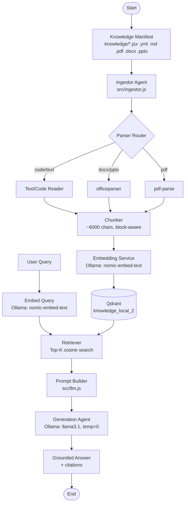

# Local Vector RAG Pipeline


A fully local Retrieval-Augmented Generation (RAG) pipeline built with **Qdrant** and **Ollama**. No cloud APIs, no API keys — embedding generation, vector search and answer generation all run on-device.

Point it at a manifest of mixed documents (code, YAML, PDFs, DOCX, PPTX), ingest them into a local vector database, and ask questions grounded strictly in that content — with mandatory citations and a hard refusal to answer when the information isn't present.

---

## Features

- Fully local pipeline — no external API calls at ingest or query time
- Multi-format ingestion: `.js/.jsx`, `.yml`, `.md`, `.pdf`, `.docx`, `.pptx`
- Manifest-driven ingestion for controlled, predictable knowledge bases
- Local embeddings via Ollama (`nomic-embed-text`)
- Local generation via Ollama (`llama3.1`) at zero temperature for deterministic answers
- Qdrant vector store with cosine similarity search
- Source-tagged, citation-enforced answers
- Prompt-injection resistant context framing (XML-wrapped documents)
- Explicit refusal when context doesn't contain the answer
- Simple CLI: `ingest` and `ask`

---

## Architecture



---

## Pipeline Stage Responsibilities

| Stage | Responsibility |
|-------|----------------|
| Manifest | Explicit, hard-coded list of files to ingest — no blind directory crawling. |
| Ingestor | Routes each file to the correct parser based on extension. |
| Parser Router | Dispatches to plain-text read, `officeparser`, or `pdf-parse`. |
| Chunker | Splits extracted text into ~6000-character, line-aware chunks tagged with source path. |
| Embedding Service | Converts chunks (and queries) into 768-dim vectors locally via Ollama. |
| Vector Store | Persists and searches embeddings in Qdrant using cosine distance. |
| Retriever | Fetches the top-K most relevant chunks for a given query. |
| Prompt Builder | Wraps retrieved chunks in XML `<document>` tags with a strict, injection-resistant system prompt. |
| Generation Agent | Produces a citation-backed answer at `temperature: 0`, or refuses if ungrounded. |

---

## Tech Stack & Libraries

### Core Technologies

| Category | Technology |
|----------|------------|
| Runtime | Node.js (ES Modules) |
| Vector Database | Qdrant (Docker) |
| Embedding Model | Ollama — `nomic-embed-text` |
| Generation Model | Ollama — `llama3.1` |

### Libraries Used

| Library | Purpose |
|---------|---------|
| @qdrant/js-client-rest | Qdrant vector database client |
| ollama | Local embedding + LLM inference |
| officeparser | Text extraction from `.docx` / `.pptx` |
| pdf-parse-debugging-disabled | Text extraction from `.pdf` |
| dotenv | Environment variable loading |
| prettier | Code formatting |

---

## Installation

### Prerequisites

- Node.js 18+
- [Docker](https://www.docker.com/) (for Qdrant)
- [Ollama](https://ollama.com) installed locally

### Clone Repository

```bash
git clone https://github.com/sanchit0496/vectordb-rag.git
cd vectordb-rag
```

### Install Dependencies

```bash
npm install
```

### Pull Required Ollama Models

```bash
ollama pull nomic-embed-text
ollama pull llama3.1
```

---

## Start the Vector Database

```bash
docker-compose up -d
```

Qdrant dashboard: `http://localhost:6333/dashboard`

---

## Run the Pipeline

### Ingest the knowledge base

```bash
node index.js ingest
```

### Ask a question

```bash
node index.js ask "What frameworks does the Developer Knowledge Portal support?"
```

---

## Working Example

To validate the engine’s architectural integrity, I performed a "Fault Injection" stress test on the `FrameworkUI.jsx` component. This process demonstrated the engine's ability to act as an automated, context-aware architectural guardrail.

#### 1. Fault Injection (The Bugs)
I intentionally introduced three high-severity architectural violations to test the engine's diagnostic capabilities:

*   **Missing Authorization:** Stripped the mandatory JWT `Authorization` header required for secure API resource access.
*   **Inconsistent Versioning:** Limited `X-Client-Version` header enforcement to the initial mount, failing to apply it to subsequent GET requests.
*   **Debounce Failure:** Removed input debouncing, creating a race condition where rapid framework switching triggered multiple redundant API calls.

#### 2. The Remediation Workflow
I utilized the RAG engine to perform a live compliance audit and automated code correction:

| Phase | Action |
| :--- | :--- |
| **Audit Phase** | Queried the engine: *"Read the file content inside FrameworkUI.jsx. Look at the exact fetch call and tell me which headers and debounce logic are missing compared to the rules in the PDF and PPT."* |
| **Intelligence Phase** | The engine cross-referenced the corrupted source code against the enterprise policy documents, successfully pinpointing each specific violation. |
| **Correction Phase** | The engine generated a fully remediated `useSWR` implementation that enforced the required security headers and debounce logic, providing a production-ready fix. |

#### 3. Evidence of Success
The following audit output confirms the engine correctly identified the missing headers and logic gaps:


---


## Project Structure

```text
vectordb-rag/
├── knowledge/
│   ├── FrameworkUI.jsx
│   ├── swagger.yml
│   ├── *.pdf / *.docx / *.pptx
├── src/
│   ├── ingestor.js        # File parsing + chunking
│   ├── vectorStore.js     # Qdrant + embedding logic
│   └── llm.js             # Prompt construction + grounded generation
├── data/
│   └── qdrant_storage/    # Local Qdrant persistence (via Docker volume)
├── docker-compose.yml
├── index.js                # CLI entry point (ingest / ask)
└── package.json
```

---

## Customization

### Change the ingestion manifest

```javascript
// src/ingestor.js
const TARGET_FILES = [
    './knowledge/FrameworkUI.jsx',
    './knowledge/swagger.yml',
    './knowledge/your-new-file.pdf',
];
```

### Adjust retrieval size

```javascript
// index.js
const relevantChunks = await search(query, 30); // top-K chunks
```

### Adjust chunk size

```javascript
// src/ingestor.js
chunkText(text, maxChunkSize = 6000);
```

### Customize the system prompt

Update the grounding rules, citation format, or refusal behavior inside `src/llm.js`.

---

## Roadmap

- Configurable chunk size / overlap via CLI flags
- Config-file-driven manifest instead of hard-coded array
- `node index.js reset` command to clear the Qdrant collection
- Streaming answers instead of blocking on full generation
- Support for additional file types (`.csv`, `.html`)
- Web UI for querying

---

## License

Licensed under the ISC License.
