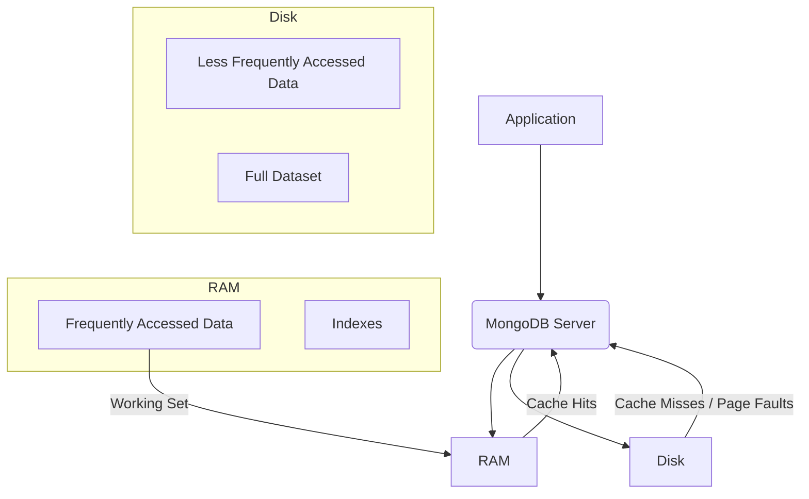

# Mastering MongoDB Schema Design for High-Performance & Scalable Applications

# MongoDB Schema Design Best Practices for High-Performance Applications

MongoDB's flexible document model is a double-edged sword. While it offers unparalleled agility and ease of development, the absence of a rigid schema means that achieving high performance and scalability in production environments hinges almost entirely on thoughtful schema design. It's not enough to simply "throw data in"; mastering MongoDB schema design demands a strategic balance between data embedding, referencing, denormalization, and advanced indexing to align perfectly with application access patterns and scalability goals.

This article dives deep into the best practices for designing MongoDB schemas that power high-throughput, low-latency applications. We'll explore the foundational choices, advanced optimization techniques, and practical patterns that system architects, software engineers, and database administrators need to leverage for optimal performance and horizontal scalability.

## Introduction: The Cornerstone of MongoDB Performance

MongoDB, a leading NoSQL document database, empowers developers with a dynamic and flexible schema. Unlike traditional relational databases that enforce a predefined structure, MongoDB allows documents within a collection to have varying fields and structures. This flexibility accelerates development and simplifies schema evolution, but it also places the onus of good design squarely on the developer.

A well-designed MongoDB schema is the bedrock of a high-performance application. It dictates how efficiently data can be read, written, and scaled. Poor schema choices can lead to excessive network round trips, inefficient queries, bloated working sets, and uneven data distribution across shards, ultimately crippling application responsiveness and hindering scalability. Conversely, a strategic schema optimizes data locality, minimizes I/O operations, facilitates rapid query execution, and supports seamless horizontal scaling. This article will guide you through the critical decisions and techniques required to build performant and scalable MongoDB applications.

## Foundational Choices: Embedding vs. Referencing

The first and most fundamental decision in MongoDB schema design revolves around how to model relationships between different pieces of data: should related data be embedded within a single document, or referenced across separate documents? This choice profoundly impacts performance, data consistency, and scalability.

### Embedding Related Data (One-to-One, One-to-Few)

Embedding involves storing related data directly within a single MongoDB document. This approach leverages MongoDB's document model to keep frequently accessed, tightly coupled data together.

**Conceptual Diagram: Embedded Data**

```mermaid
graph TD
    A[Order Document] --> B[OrderID]
    A --> C[CustomerInfo (Embedded)]
    A --> D[LineItems (Array of Embedded Products)]
    C --> C1[CustomerID]
    C --> C2[Name]
    D --> D1[Product1]
    D --> D2[Product2]
    D1 --> D1a[ProductID]
    D1 --> D1b[Name]
    D1 --> D1c[Quantity]
```

**Example:** An `order` document embedding `customer_info` and an array of `line_items`.

```javascript
// Embedded Model
{
  "_id": ObjectId("654c2a1c0e81f2b3c4d5e6f0"),
  "orderId": "ORD-2023-1001",
  "orderDate": ISODate("2023-10-26T10:00:00Z"),
  "customer": {
    "customerId": "CUST-001",
    "name": "Alice Smith",
    "email": "alice@example.com"
  },
  "lineItems": [
    {
      "productId": "PROD-001",
      "name": "Laptop Pro",
      "quantity": 1,
      "price": 1200.00
    },
    {
      "productId": "PROD-005",
      "name": "Wireless Mouse",
      "quantity": 2,
      "price": 25.00
    }
  ],
  "totalAmount": 1250.00,
  "status": "completed"
}
```

**Pros of Embedding:**

- **Read Performance:** A single query retrieves all necessary data, minimizing network round trips and eliminating the need for application-level joins. Data locality on disk and in memory improves cache efficiency.
- **Atomic Updates:** Updates to embedded fields within a single document are atomic. This simplifies concurrency control for related data, ensuring consistency without complex locking mechanisms for single-document modifications.
- **Simplicity:** Often fewer collections to manage and simpler application code for data retrieval.

**Cons of Embedding:**

- **Document Size Limit:** MongoDB documents have a strict 16MB size limit. Large embedded arrays or deeply nested structures can quickly hit this ceiling, especially for unbounded relationships.
- **Write Amplification:** Updating a small part of a large embedded array might require rewriting the entire document on disk. If the document grows beyond its allocated space, MongoDB must relocate it, increasing I/O operations and impacting write performance.
- **Data Duplication:** If the embedded data needs to appear in multiple parent documents (e.g., product details in multiple orders), it leads to duplication and potential consistency challenges if the source data changes.
- **Working Set Impact:** Larger documents consume more memory, potentially reducing the effective working set size (data that fits in RAM) and increasing costly disk I/O for less frequently accessed data.

### Referencing Related Data (One-to-Many, Many-to-Many)

Referencing involves storing related data in separate documents, typically in different collections, and establishing relationships using document IDs. This is analogous to foreign keys in relational databases.

**Conceptual Diagram: Referenced Data**

```mermaid
graph TD
    A[Order Document] --> B[OrderID]
    A --> C[CustomerID (Reference)]
    A --> D[LineItemIDs (Array of References)]
    C -- "References" --> C_COL[Customers Collection]
    D -- "References" --> L_COL[LineItems Collection]
    C_COL --> C1[Customer Document]
    L_COL --> L1[LineItem Document]
```

**Example:** An `order` document referencing a `customer` document and multiple `line_item` documents.

```javascript
// Customer Collection
{
  "_id": ObjectId("CUST-001"), // Custom ID for customer
  "name": "Alice Smith",
  "email": "alice@example.com",
  "address": { ... }
}

// Order Collection
{
  "_id": ObjectId("654c2a1c0e81f2b3c4d5e6f0"),
  "orderId": "ORD-2023-1001",
  "orderDate": ISODate("2023-10-26T10:00:00Z"),
  "customerId": "CUST-001", // Reference to Customer
  "lineItemIds": [ // References to LineItem documents
    ObjectId("LINE-001"),
    ObjectId("LINE-002")
  ],
  "totalAmount": 1250.00,
  "status": "completed"
}

// LineItem Collection
{
  "_id": ObjectId("LINE-001"),
  "orderId": ObjectId("654c2a1c0e81f2b3c4d5e6f0"), // Optional back-reference
  "productId": "PROD-001",
  "name": "Laptop Pro",
  "quantity": 1,
  "price": 1200.00
}
// ... another line item document
```

**Pros of Referencing:**

- **Flexibility:** No document size limit constraints, allowing for large or unbounded relationships (e.g., an author with millions of books).
- **Reduced Duplication:** Data is stored once, simplifying updates and ensuring consistency for the referenced entity.
- **Independent Updates:** Referenced documents can be updated independently without affecting other documents that reference them.
- **Many-to-Many Relationships:** Easier to model complex many-to-many relationships without excessive data duplication.

**Cons of Referencing:**

- **Increased Queries/Network Round Trips:** Retrieving related data often requires multiple queries (application-level joins), increasing latency and network overhead.
- **Application-Level Join Complexity:** The application layer must manage the logic for resolving references, potentially increasing code complexity.
- **Consistency Challenges:** Without transactions (available in MongoDB 4.0+ for replica sets and 4.2+ for sharded clusters), ensuring consistency across multiple documents during multi-document updates can be complex.
- **Performance Overhead of `$lookup`:** While `$lookup` provides SQL-like join capabilities within the aggregation framework, for high-volume, simple lookups, it can be less performant than well-designed embedded models or even carefully optimized application-level joins. `$lookup` is best suited for complex analytical queries or when the join logic is tightly coupled with other aggregation stages.

**When to Choose Which:**

- **Embed** when:
  - The relationship is One-to-One or One-to-Few (e.g., a book has a single publisher, an order has a few line items).
  - The embedded data is frequently accessed with its parent.
  - Updates to the embedded data need to be atomic with the parent document.
  - The embedded data doesn't exceed the 16MB document limit.
- **Reference** when:
  - The relationship is One-to-Many or Many-to-Many, and the "many" side can be unbounded (e.g., users and blog posts, tags and products).
  - The related data is large or frequently updated independently.
  - You need to avoid data duplication for entities that change often.

The key is to model data based on how your application _accesses_ it, prioritizing read performance for common paths while managing the trade-offs.

## Strategic Denormalization for Read Optimization

Denormalization in MongoDB involves duplicating specific data fields across multiple documents or collections to optimize read performance. This technique is a powerful antidote to the "join penalty" inherent in referenced data models. By strategically embedding copies of frequently accessed data, you can eliminate the need for subsequent queries or application-level joins, dramatically boosting read latency and throughput.

**Principles of Denormalization:**
Instead of storing only IDs and fetching related data, you might store key pieces of information from the referenced document directly within the referencing document.

**Use Case: Product Details in Order Line Items**
Consider an `order` document that references `product` documents. If every time an order is viewed, the application needs the product name and price, performing a lookup for each `lineItem.productId` can be slow. By denormalizing the `product_name` and `product_price` into the `lineItems` array, the order document becomes self-contained for display purposes.

**Denormalized Order Document Example:**

```javascript
{
  "_id": ObjectId("654c2a1c0e81f2b3c4d5e6f0"),
  "orderId": "ORD-2023-1001",
  "orderDate": ISODate("2023-10-26T10:00:00Z"),
  "customerId": "CUST-001",
  "customerName": "Alice Smith", // Denormalized from Customer collection
  "lineItems": [
    {
      "productId": "PROD-001",
      "productName": "Laptop Pro", // Denormalized from Product collection
      "unitPrice": 1200.00,        // Denormalized from Product collection
      "quantity": 1,
      "subtotal": 1200.00
    },
    {
      "productId": "PROD-005",
      "productName": "Wireless Mouse", // Denormalized
      "unitPrice": 25.00,             // Denormalized
      "quantity": 2,
      "subtotal": 50.00
    }
  ],
  "totalAmount": 1250.00,
  "status": "completed"
}
```

**Performance Benefits for Read-Heavy Workloads:**

- **Eliminates Lookups:** The most significant benefit is avoiding extra database queries. A single `find` operation retrieves all necessary information.
- **Reduced Network Latency:** Fewer round trips to the database server.
- **Lower Database Load:** Less CPU and I/O on the database server as it doesn't need to process multiple queries or `$lookup` stages for a single logical read.
- **Improved Cache Efficiency:** Self-contained documents are more likely to be entirely cached, leading to higher cache hit rates.

**Challenges of Data Consistency and Strategies for Managing Updates:**
The primary drawback of denormalization is maintaining data consistency. If the source data changes (e.g., a product's name or price is updated), all denormalized copies must also be updated.

**Strategies for Consistency:**

1.  **Eventual Consistency:** For data where immediate consistency isn't critical (e.g., an old order's product name doesn't need to reflect the very latest product name change), you can accept eventual consistency.
2.  **Application-level Multi-Document Updates:** When the source data changes, the application can issue updates to all documents containing the denormalized copy. This can be done:
    - **Synchronously:** As part of the original write transaction. This requires careful error handling and potentially multi-document transactions (MongoDB 4.0+).
    - **Asynchronously:** Using a message queue (e.g., Kafka, RabbitMQ) or change streams to propagate updates in the background. This decouples the update process and prevents blocking the primary write.
3.  **Selective Denormalization:** Only denormalize fields that are critical for read performance and rarely change. For highly volatile data, referencing might still be the better option.

**Increased Storage Space Considerations:**
Denormalization inherently increases storage space due to data duplication. However, in many high-performance scenarios, the cost of increased storage is a worthwhile trade-off for significantly improved read performance, especially given the decreasing cost of storage and the higher cost of CPU/I/O on database servers. Always weigh the storage cost against the performance gains for your specific workload.

## Mastering Advanced Indexing for Query Efficiency

Indexes are crucial for achieving high query performance in MongoDB, allowing the database to efficiently locate documents without scanning every document in a collection. Beyond basic single-field indexes, advanced strategies are essential for complex queries, large datasets, and specific access patterns.

### Compound Indexes: Design, Prefix Matching, and Sort Optimization

Compound indexes are defined on multiple fields (e.g., `{ 'userId': 1, 'timestamp': -1 }`). They are powerful because they can support queries that filter or sort on multiple fields, often covering a range of related query patterns.

**Design Considerations:**

- **Equality, Sort, Range (ESR) Rule:** A good heuristic for ordering fields in a compound index:
  1.  **Equality:** Fields used for exact matches first (e.g., `status: 'active'`).
  2.  **Sort:** Fields used for sorting next (e.g., `timestamp: -1`).
  3.  **Range:** Fields used for range queries last (e.g., `price: { $gt: 100 }`).
- **Prefix Optimization:** A compound index on `{ a: 1, b: 1, c: 1 }` can satisfy queries on `a`, `a` and `b`, or `a`, `b`, and `c`. A query only on `b` or `c` will not efficiently use this index.
- **Sort Optimization:** If a query includes a sort operation, a compound index can satisfy the sort if the sort order matches the index order (or the reverse order). For example, `db.collection.find({userId: 123}).sort({timestamp: -1})` would use `{ userId: 1, timestamp: -1 }`.

**Example:**
Create a compound index for queries that find orders for a specific customer, sorted by date in descending order:

```javascript
db.orders.createIndex({ customerId: 1, orderDate: -1 });

// This query can use the index efficiently:
db.orders.find({ customerId: 'CUST-001', orderDate: { $gte: ISODate('2023-01-01') } }).sort({ orderDate: -1 });

// This query can also use the index (prefix match):
db.orders.find({ customerId: 'CUST-001' });
```

### Partial Indexes: Reducing Index Footprint and Write Overhead

Partial indexes only index documents in a collection that satisfy a specified filter expression. This significantly reduces index size and write overhead, making them ideal for collections with a large number of documents where only a subset is frequently queried for a specific condition.

**Example:**
Index only active users for faster lookups, reducing the index size compared to indexing all users.

```javascript
db.users.createIndex({ status: 1, lastLogin: -1 }, { partialFilterExpression: { status: 'active' } });

// This query will use the partial index:
db.users.find({ status: 'active', lastLogin: { $gte: ISODate('2023-10-01') } });

// This query WILL NOT use the partial index efficiently (it doesn't match the filter expression):
db.users.find({ status: 'inactive' });
```

### TTL (Time-To-Live) Indexes for Automatic Data Expiry

TTL indexes are special single-field indexes on a date field that automatically remove documents from a collection after a specified amount of time. They are perfect for managing data like session logs, event data, or temporary caches.

**Example:**
Automatically delete logs older than 30 days.

```javascript
db.log_events.createIndex(
  { createdAt: 1 },
  { expireAfterSeconds: 60 * 60 * 24 * 30 }, // 30 days
);
```

### Covered Queries: Achieving Maximum Read Performance

A query is "covered" if all fields in the query (the query predicate and the projected fields) are part of an index, and no documents need to be examined. This allows MongoDB to return results directly from the index, significantly reducing I/O and improving performance.

**Requirements for a Covered Query:**

1.  All fields in the query predicate (the `find()` part) are part of the index.
2.  All fields in the projection (the fields returned) are part of the index.
3.  No other fields are projected, except `_id: 0` (to exclude the `_id` field).

**Example:**
Index `userId` and `status`.

```javascript
db.tasks.createIndex({ userId: 1, status: 1 });

// This query is covered:
db.tasks.find({ userId: 'user123', status: 'pending' }, { userId: 1, status: 1, _id: 0 });

// Using explain() to verify:
db.tasks.find({ userId: 'user123', status: 'pending' }, { userId: 1, status: 1, _id: 0 }).explain('executionStats');
// Look for "COLLSCAN": false and "IXSCAN" in winningPlan, and "totalDocsExamined": 0.
```

### Index Selectivity and Cardinality

- **Selectivity:** An effective index has high selectivity, meaning it narrows down the result set significantly.
- **Cardinality:** High cardinality (many unique values) in an indexed field generally leads to better selectivity. Low cardinality fields (e.g., `status: 'active'` or `status: 'inactive'`) are less effective as primary index fields unless combined with other fields in a compound index or used with partial indexes.

### Understanding MongoDB's Query Planner and `explain()` Output

MongoDB's query planner automatically selects the most efficient index for a given query. Understanding `explain()` output is crucial to verify if indexes are being used as intended, identify slow queries, and diagnose issues like collection scans or inefficient index usage. Schema design directly influences the options available to the query planner. Always use `explain()` to validate your indexing strategy.

### The Inherent Optimization of the `_id` Index

Every MongoDB collection automatically has a unique index on the `_id` field. This index is highly efficient for queries targeting specific documents by their `_id`. For high-performance applications, always consider using the `_id` field (or a custom primary key that serves a similar purpose) for direct document access when possible, as it leverages this inherent optimization.

## Designing for Horizontal Scalability: Sharding Considerations

Sharding is MongoDB's method for horizontal scaling, distributing data across multiple machines (shards). Effective schema design, particularly the choice of a shard key, is paramount for realizing the benefits of sharding, ensuring even data distribution, preventing 'hot spots,' and enabling efficient query routing.

**Conceptual Diagram: Sharded Cluster**

```mermaid
graph TD
    A[Application] --> B(Mongos Router)
    B --> C[Shard 1]
    B --> D[Shard 2]
    B --> E[Shard N]
    C -- "Contains data range X-Y" --> C1[Replica Set Member 1]
    C -- "Contains data range X-Y" --> C2[Replica Set Member 2]
    C -- "Contains data range X-Y" --> C3[Replica Set Member 3]
    D -- "Contains data range Y-Z" --> D1[Replica Set Member 1]
    E -- "Contains data range A-B" --> E1[Replica Set Member 1]
    B --- F[Config Servers (Replica Set)]
```

### Impact of Schema Design on Shard Key Selection

A shard key is a field or compound of fields used to partition a collection's data across shards. MongoDB uses the shard key to determine which shard stores a document. Once a collection is sharded, its shard key cannot be changed. This makes the initial design choice critical.

### Achieving Even Data Distribution and Avoiding Hot Spots

The primary goal of a shard key is to distribute data evenly across all shards.

- **Good Shard Key:** A high-cardinality field with a uniform distribution of values (e.g., `user_id` if users are evenly distributed, or a compound key including a unique or random component). This prevents 'hot spots' where all new writes or a disproportionate number of reads hit a single shard, maximizing parallel processing.
- **Bad Shard Key (Hot Spots):**
  - **Monotonically Increasing/Decreasing Key:** A shard key like `timestamp` or `_id` (default `ObjectId` is time-based) can lead to all new inserts going to the same shard, creating a write hot spot.
  - **Low-Cardinality Key:** A key with few distinct values (e.g., `status` field with 'active'/'inactive') will result in data being heavily concentrated on a few shards, leading to hot spots for reads and writes on those shards.

### Efficient Query Routing vs. Scatter-Gather Queries

- **Efficient Query Routing:** Queries that include the full shard key (or the prefix of a compound shard key) can be routed directly to the relevant shard(s). This is extremely efficient, as `mongos` (the query router) knows exactly where the data resides.
- **Scatter-Gather Queries:** Queries that do not include the shard key (or sufficient prefix) must be sent to _all_ shards. Each shard performs the query on its subset of data, and `mongos` gathers and merges the results. This increases latency and resource utilization across the entire cluster, negating many benefits of sharding.

### Data Locality and its Performance Benefits

Data locality refers to storing related data on the same shard. If an application frequently queries multiple documents together (e.g., a user's profile and their recent posts), designing a schema where these related documents share a common shard key prefix (e.g., `userId`) can ensure they reside on the same shard. This improves performance by minimizing network hops between shards and allowing queries to be routed to a single shard.

### Shard Key Immutability and its Design Implications

The chosen shard key cannot be changed after a collection is sharded. This means any changes to your application's access patterns or data distribution needs _after_ sharding can be extremely difficult to address without re-sharding, which is an operationally intensive task. Therefore, careful upfront planning for shard key selection is paramount.

**Example of a Good Shard Key:**
For a multi-tenant application where data is almost always accessed per tenant:

```javascript
// Create an index on the shard key first
db.tenant_data.createIndex({ tenantId: 1, createdAt: 1 });

// Shard the collection using a compound shard key
sh.shardCollection('mydatabase.tenant_data', { tenantId: 1, createdAt: 1 });
```

This compound key supports queries specific to a `tenantId` (efficient routing) and, within a tenant, allows for range queries on `createdAt`. If `tenantId` has high cardinality and balanced access, it's a good choice. If `tenantId` has low cardinality or unbalanced access, a hashed shard key on `tenantId` might be better to ensure even distribution.

**Example of a Bad Shard Key:**
Using only a timestamp for a collection of events:

```javascript
// This will create a hot spot for writes as new events always go to the same shard.
sh.shardCollection('mydatabase.events', { timestamp: 1 });
```

Choosing an effective shard key requires deep understanding of your application's read and write patterns, ensuring both even data distribution and efficient query routing.

## Practical Data Model Patterns for Common Use Cases

Beyond the fundamental embedding vs. referencing decision, several established data model patterns address common application requirements while optimizing for MongoDB's strengths.

### 1. Attribute Pattern for Dynamic and Flexible Schemas

The Attribute Pattern is useful when documents have a large number of optional or dynamic attributes, or when you need to query on these attributes without creating an excessive number of indexes. Instead of individual fields, these attributes are stored in an array of sub-documents, each containing a `key` and `value`.

**Use Case:** E-commerce product specifications, user profiles with custom fields.

**Example:**
A `product` document with various specifications.

```javascript
{
  "_id": ObjectId("654c2a1c0e81f2b3c4d5e6f0"),
  "productId": "PROD-ABC",
  "name": "Super Laptop",
  "category": "Electronics",
  "specifications": [
    { "k": "processor", "v": "Intel i9" },
    { "k": "RAM", "v": "32GB" },
    { "k": "storage", "v": "1TB SSD" },
    { "k": "color", "v": "Space Gray" },
    { "k": "weight_kg", "v": 1.5 }
  ]
}
```

**Performance Rationale:**

- **Indexing:** A single compound index on `specifications.k` and `specifications.v` can efficiently query across all attributes.
  ```javascript
  db.products.createIndex({ 'specifications.k': 1, 'specifications.v': 1 });
  // Query for products with 32GB RAM:
  db.products.find({ specifications: { $elemMatch: { k: 'RAM', v: '32GB' } } });
  ```
- **Flexibility:** Easily add new specifications without schema migration.
- **Sparse Attributes:** Avoids documents with many null or undefined fields.

**Conceptual Diagram: Attribute Pattern**

```mermaid
graph TD
    A[Product Document] --> B[ProductID]
    A --> C[Name]
    A --> D[Category]
    A --> E[Specifications Array]
    E --> E1[Sub-document {k: "RAM", v: "32GB"}]
    E --> E2[Sub-document {k: "Color", v: "Black"}]
```

### 2. Bucket Pattern for Time-Series Data and Efficient Aggregations

The Bucket Pattern is ideal for time-series data or any data that needs to be aggregated over specific time intervals. Instead of storing each event as a separate document, multiple events within a time "bucket" (e.g., an hour, a day) are embedded into a single document.

**Use Case:** IoT sensor data, website analytics, stock prices.

**Example:**
Sensor readings for a single device, grouped into hourly buckets.

```javascript
{
  "_id": ObjectId("654c2a1c0e81f2b3c4d5e6f0"),
  "device_id": "SENSOR-001",
  "timestamp_hour": ISODate("2023-10-26T10:00:00Z"), // Start of the hour
  "readings_count": 5,
  "min_temp": 20.1,
  "max_temp": 22.5,
  "avg_temp": 21.3,
  "readings": [ // Array of individual readings for the hour
    { "t": ISODate("2023-10-26T10:05:00Z"), "v": 20.8 },
    { "t": ISODate("2023-10-26T10:15:00Z"), "v": 21.2 },
    { "t": ISODate("2023-10-26T10:30:00Z"), "v": 22.0 },
    // ... more readings
  ]
}
```

**Performance Rationale:**

- **Reduced Document Count:** Fewer documents overall, making queries and aggregations faster as less metadata needs to be processed.
- **Improved Data Locality:** All readings for a specific hour are in one document, improving cache efficiency for time-range queries.
- **Pre-Aggregation:** Common aggregations (min, max, avg) can be stored directly in the bucket document, reducing computation at query time.
- **Efficient Indexing:** Indexing `device_id` and `timestamp_hour` allows for quick retrieval of buckets.
  ```javascript
  db.sensor_data_hourly.createIndex({ device_id: 1, timestamp_hour: 1 });
  // Query for all readings for a device during a specific hour:
  db.sensor_data_hourly.find({ device_id: 'SENSOR-001', timestamp_hour: ISODate('2023-10-26T10:00:00Z') });
  ```

**Conceptual Diagram: Bucket Pattern**

```mermaid
graph TD
    A[Hourly Bucket Document] --> B[DeviceID]
    A --> C[Timestamp (Hour)]
    A --> D[Aggregated Data (Min/Max/Avg)]
    A --> E[Readings Array]
    E --> E1[Reading 1 {t: time1, v: value1}]
    E --> E2[Reading 2 {t: time2, v: value2}]
    E --> E_N[Reading N {t: timeN, v: valueN}]
```

### 3. Extended Reference Pattern for 'Joining' Related Data with Denormalization

This pattern combines referencing with strategic denormalization. Instead of just storing an ID, you store the ID _plus_ a few frequently accessed fields from the referenced document. This allows for efficient retrieval of some related data without an extra lookup, while still allowing for full lookups when needed.

**Use Case:** User with their associated company, where company name is often needed, but full company details are only sometimes. Blog post with author name.

**Example:**
A `blog_post` document that references an `author` but also denormalizes the author's name.

```javascript
// Author Collection
{
  "_id": ObjectId("AUTH-001"),
  "name": "Jane Doe",
  "email": "jane@example.com",
  "bio": "Expert in MongoDB."
}

// Blog Post Collection
{
  "_id": ObjectId("POST-001"),
  "title": "MongoDB Schema Design",
  "content": "...",
  "authorId": ObjectId("AUTH-001"),
  "authorName": "Jane Doe", // Denormalized author name
  "publishedDate": ISODate("2023-10-26T14:00:00Z"),
  "tags": ["mongodb", "schema", "performance"]
}
```

**Performance Rationale:**

- **Optimized Display:** For lists of blog posts, the author's name is immediately available without an extra query.
- **Reduced Reads:** Avoids N+1 query problems for common display scenarios.
- **Full Data Access:** If more author details are needed (e.g., for an author profile page), a separate query can be made using `authorId`.
- **Manageable Consistency:** Only a few fields are denormalized, so updates to the `author` document might only require updating `authorName` in `blog_post` documents, which can be handled with eventual consistency or background jobs.

**Conceptual Diagram: Extended Reference Pattern**

```mermaid
graph TD
    A[Blog Post Document] --> B[PostID]
    A --> C[Title]
    A --> D[AuthorID (Reference)]
    A --> E[AuthorName (Denormalized)]
    D -- "References" --> F[Author Document]
    F --> F1[Author Name]
    F --> F2[Author Bio]
```

These patterns illustrate how combining embedding, referencing, and denormalization with specific structures can address complex data modeling challenges while maintaining high performance. The choice of pattern should always be driven by your application's specific access patterns and performance requirements.

## Working Set Optimization: Memory, I/O, and Document Sizing

The "working set" is the subset of data and indexes that your application frequently accesses. For optimal performance, the working set should ideally fit entirely within RAM. When data is not in RAM, MongoDB must retrieve it from disk, which is orders of magnitude slower and significantly impacts latency and throughput. Schema design choices directly affect the size of the working set and, consequently, memory utilization and disk I/O.

**Conceptual Diagram: Working Set in RAM**



### Impact of Document Size on Memory Utilization and I/O

- **Larger Documents:**
  - **Higher Memory Footprint:** Each document consumes more memory, meaning fewer documents can fit into RAM. This reduces the effective working set size.
  - **Increased I/O:** If only a small part of a large document is needed, the entire document must still be read from disk into memory. This leads to inefficient I/O, as unnecessary data is loaded.
  - **Slower Reads/Writes:** Reading and writing larger documents inherently take more time due to the increased data volume.
  - **Higher Write Amplification:** Updates to large documents are more likely to cause the document to be relocated on disk if it grows, leading to increased I/O.
- **Smaller, Focused Documents:**
  - **Better Working Set Utilization:** More documents can fit into RAM, increasing the likelihood of cache hits and reducing costly disk I/O.
  - **Faster Individual Document Operations:** Less data to read/write for single document operations.
  - **Improved Cache Efficiency:** Individual documents are more likely to be cached entirely, leading to higher cache hit rates.

### Trade-offs Between Smaller, Focused Documents and Larger, Embedded Documents

This highlights the core tension in schema design. While embedding (resulting in larger documents) can reduce network round trips and enable atomic updates, it can also bloat the working set. Referencing (resulting in smaller documents) can keep the working set compact but might increase the number of queries.

**Strategies to Keep the Working Set Compact:**

1.  **Prioritize Relevant Data:** Only store data that is truly necessary for your application. Avoid embedding excessively large or rarely accessed data within frequently accessed documents.
2.  **Shallow Embedding:** Limit the depth of embedded documents and the size of embedded arrays. If an array can grow unbounded, consider referencing instead.
3.  **Efficient Indexing:** Smaller, more selective indexes consume less RAM, leaving more space for actual data. Partial indexes are particularly useful here.
4.  **Decompose Large Documents:** If a document is consistently hitting the 16MB limit or contains distinct logical sections, consider splitting it into multiple, related documents that can be referenced. For example, a `user` document might have a `user_profile` document for less frequently accessed details.
5.  **Data Archiving/TTL:** Use TTL indexes or manual archiving to remove old, inactive data from your active collections, keeping the working set focused on current data.

By meticulously evaluating document size and embedding strategies, you can significantly influence how much of your active data resides in RAM, directly impacting your application's performance and scalability.

## Graceful Schema Evolution in Production

In agile development environments, schema changes are inevitable. For high-performance, high-volume MongoDB applications, these changes must be handled gracefully to avoid downtime, performance degradation, or data inconsistency. MongoDB's flexible schema offers advantages, but careful planning is still required.

### Designing for Backward Compatibility

The most crucial strategy is to design new schema versions to be compatible with older application versions.

- **New Fields as Optional:** Always introduce new fields as optional. Older application versions will simply ignore them.
- **Default Values:** If a new field is essential, ensure your application code can handle its absence (e.g., by providing a default value).
- **Avoid Renaming/Deleting Critical Fields:** Renaming or deleting fields that older application versions rely on will break them. If a field must be removed, consider a multi-step migration or deprecation phase.
- **Incremental Changes:** Favor small, incremental schema changes over large, disruptive ones.

### Strategies for Background Data Migrations

For significant schema changes (e.g., splitting a large document, denormalizing a new field, changing data types), background migrations are essential to avoid blocking your application.

1.  **Multi-Version Application Code:** The application should support both the old and new schema versions during the migration period. When writing, it might write to both, and when reading, it can check for the new schema and fall back to the old.
2.  **Iterative Migration Script:** Write a script that iterates through the collection, updates documents to the new schema, and performs the updates in batches to minimize impact on the database.
3.  **Version Field:** Add a `schema_version` field to documents. The migration script can target documents with an older version, and the application can use this field to determine how to interpret a document.
4.  **Change Streams:** For real-time updates or to trigger migrations in response to data changes, MongoDB's Change Streams can be invaluable.
5.  **Rollback Plan:** Always have a rollback plan. This might involve backing up data or ensuring the old application version can still function if the migration fails.

### Leveraging MongoDB's Flexible Schema for Agile Evolution

MongoDB's schemaless nature is a significant advantage for agile development.

- **Adding Fields:** You can add new fields to documents without requiring a full collection-wide schema migration.
- **Embedded Documents:** New sub-documents or arrays can be added as needed.
- **Iterative Refinement:** This flexibility allows for gradual schema evolution, where you can refine your data model over time based on actual usage patterns and performance observations.

### Versioning Schemas and Application Code

For complex systems, consider a formal versioning strategy:

- **Database Schema Version:** Maintain a document in a dedicated `db_metadata` collection that tracks the current schema version of each collection.
- **Application Code Versioning:** Ensure your application code is versioned and deployed in a way that supports the schema evolution strategy (e.g., blue/green deployments where new versions handle new schema, old versions handle old schema).

By adopting these strategies, you can manage schema changes in a controlled and performant manner, ensuring your high-volume applications remain available and responsive throughout the evolution process.

## Conclusion: A Holistic Approach to High-Performance Schema Design

Achieving high performance in MongoDB is not a matter of isolated optimizations but a result of a strategic, balanced, and holistic approach to schema design. The flexible document model, while liberating, demands a deep understanding of your application's data access patterns and a thoughtful application of MongoDB's powerful features.

We've explored the critical interplay of foundational choices:

- **Embedding** for tightly coupled, frequently co-accessed data and atomic updates.
- **Referencing** for unbounded relationships, independent updates, and reduced duplication.
- **Strategic Denormalization** to significantly boost read performance at the cost of managing consistency.
- **Advanced Indexing** (compound, partial, TTL, covered queries) to accelerate query execution, reduce I/O, and optimize for specific workloads.
- **Sharding Considerations** to ensure even data distribution, prevent hot spots, and enable efficient horizontal scalability through careful shard key selection.
- **Working Set Optimization** through mindful document sizing and embedding depth to maximize RAM utilization and minimize costly disk I/O.
- **Graceful Schema Evolution** to navigate changes in production environments without downtime or performance degradation.

The ultimate goal is to align your schema design precisely with how your application uses the data. This requires continuous analysis of access patterns, diligent performance monitoring using tools like `explain()`, and an iterative approach to design. MongoDB's power lies in its adaptability, but unlocking its full potential for high-performance applications lies firmly in the hands of a well-informed and strategic schema designer. By embracing these best practices, you can build robust, scalable, and lightning-fast applications that leverage MongoDB to its fullest.
